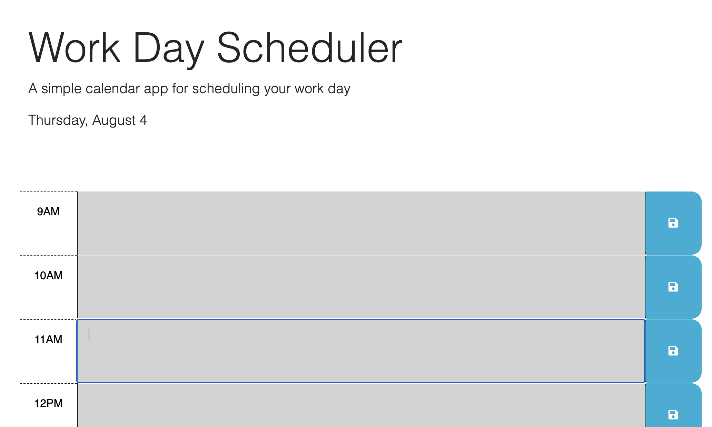

# Daily-Planner

## Description
My motivation for this was to create a daily planner for user to organize tasks. The calender is color coordinated based on whether the event has passed, currently in the time frame of the event, or if the event is in the future. I learned how to save and retrieve data with local storage as well as incorporate dayJS to retrieve and display times. 

## Installation
1. Clone from repo.
2. Open folder with visual studio code or any text editor of choice.
3. Run index.html to run code.

## Usage

This is the main page of the planner. Current date is displayed at the top. Enter event and hit save to save into time slot. 

## Deployed Website Link
https://lndvng.github.io/daily-planner/